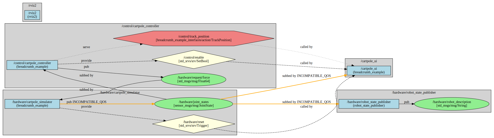

# breadcrumb

A ROS2 graph static analysis tool that works with cake and clingwrap.

## Overview

**breadcrumb** analyzes ROS2 launch files without running your system, extracting and visualizing the complete communication graph of nodes, topics, services, and actions. It's built on top of the [clingwrap](https://github.com/greenforge-labs/clingwrap) static analysis system and [cake](https://github.com/greenforge-labs/cake) node interface definition file format.


*An example graph visualisation (see [breadcrumb_example](./breadcrumb_example/README.md))*

### Key Benefits

- **Static Analysis**: Understand your system architecture without launching nodes
- **Complete Visualization**: See all publishers, subscribers, services, and actions in one view
- **Multiple Perspectives**: Generate full-system, namespace-grouped, or inter-group communication graphs
- **QoS Compatibility Checking**: Detect QoS mismatches between publishers and subscribers before runtime
- **Export Options**: Output to JSON for programmatic analysis or DOT for GraphViz visualization

### Prerequisites
- Launch files written using the [clingwrap](https://github.com/greenforge-labs/clingwrap) package
- Node interfaces defined using the [cake](https://github.com/greenforge-labs/cake) `interface.yaml` format (Note: nodes don't actually have to be written using cake - see [Packages Not Using Cake](#packages-not-using-cake))

## Usage

```bash
# Analyze a single launch file
breadcrumb my_robot.launch.py

# Analyze multiple launch files
breadcrumb robot.launch.py sensors.launch.py navigation.launch.py

# Export to JSON
breadcrumb my_robot.launch.py -o graph.json

# Generate GraphViz visualization
breadcrumb my_robot.launch.py -o graph.dot

# Generate grouped namespace views
breadcrumb my_robot.launch.py -o graph.dot --graph-type grouped_by_namespace

# Include hidden entities (names starting with _)
breadcrumb my_robot.launch.py --include-hidden
```

## Example Package

Want to see breadcrumb in action? Check out [breadcrumb_example](./breadcrumb_example/README.md), a complete ROS2 cartpole control system that demonstrates:

- How cake, clingwrap, and breadcrumb work together
- Mixed C++ and Python nodes with automatic code generation
- Modular launch file architecture with namespace organization
- Static graph analysis and visualization of the complete system
- Real-time web dashboard for monitoring and control

The example includes a working physics simulation, state feedback controller, and web UI - everything you need to understand how these tools integrate in a real application.

## How it works

When you run breadcrumb, it performs the following steps:

1. **Extract Nodes from Launch Files**: Breadcrumb loads each provided launch file and calls `generate_launch_description()` to extract static information from the clingwrap `LaunchBuilder`. This returns a list of all nodes (regular and composable) that would be launched, along with their namespaces, parameters, and remappings.

2. **Search for Interface Definitions**: For each discovered node, breadcrumb searches for a `interface.yaml` file that describes the node's communication interface. It looks in the following locations (in order):
   - `<node_package>/share/<node_package>/interfaces/`
   - `<launching_package>/share/<launching_package>/interfaces/` (if different from node package)
   - `breadcrumb/share/breadcrumb/interfaces/` (built-in interfaces for common tools)

3. **Build the Graph**: Using the node information from launch files and the interface definitions, breadcrumb constructs a complete graph by:
   - Resolving fully qualified node names with namespaces
   - Applying ROS2 name resolution rules (global, private, relative) to topics/services/actions
   - Applying remappings specified in launch files
   - Connecting publishers to subscribers, service providers to clients, etc.

4. **Output**: The final graph can be exported as JSON for programmatic analysis or rendered as GraphViz DOT diagrams for visualization.

## Cake Integration

When you build a package with cake, the build system automatically generates `interface.yaml` files from your node definitions and installs them to `share/<package>/interfaces/`. This happens during the `colcon build` process via CMake install rules that cake sets up. Even if you're not using cake to write your nodes, you can manually create and install these interface files to make your nodes compatible with breadcrumb ([Packages Not Using Cake](#packages-not-using-cake)).

## Graph Visualization

### Full System Graph

A single comprehensive view showing all nodes and their connections.

```bash
breadcrumb my_robot.launch.py -o graph.dot --graph-type full_system
```

### Grouped by Namespace

Groups nodes by their top-level namespace.

Generates multiple DOT files:
- **Top-level graph**: Shows namespace groups and inter-group communication
- **Per-group graphs**: Detailed view of each namespace with internal and external connections

```bash
breadcrumb my_robot.launch.py -o graph.dot --graph-type grouped_by_namespace
```

This creates:
- `graph_toplevel.dot` - Overview of all groups
- `graph_full_system.dot` - Complete system graph
- `graph_group_<namespace>.dot` - One per discovered namespace

### Both Views

```bash
breadcrumb my_robot.launch.py -o graph.dot --graph-type grouped_and_full_system
```

### GraphViz Visualization

After generating DOT files, render them with GraphViz:

```bash
# Generate PNG image
dot -Tpng graph_full_system.dot -o graph.png

# Generate SVG (scalable)
dot -Tsvg graph_full_system.dot -o graph.svg

# Generate PDF
dot -Tpdf graph_full_system.dot -o graph.pdf

# Process all generated DOT files
for file in graph_*.dot; do
    dot -Tpng "$file" -o "${file%.dot}.png"
done
```

### Visual Legend

- **Nodes**: Blue rectangles with node name and package
- **Topics**: Green ellipses with topic name and message type
- **Services**: Yellow diamonds with service name and type
- **Actions**: Red hexagons with action name and type

**Edge Labels**:
- `pub`: Publisher relationship
- `sub`: Subscriber relationship
- `provide`: Service provider (dashed line)
- `call`: Service/action client (dashed line)
- `serve`: Action server (dotted line)

**Edge Colors**:
- Black: Compatible QoS or no QoS defined
- Orange (bold): QoS incompatibility detected between publisher and subscriber

## JSON Export

Export graph data as JSON for programmatic analysis or custom visualizations:

```bash
breadcrumb my_robot.launch.py -o graph.json
```

**JSON Structure**:
```json
{
  "nodes": [
    {
      "fqn": "/robot1/sensors/lidar",
      "name": "lidar",
      "namespace": "robot1/sensors",
      "package": "sensor_drivers",
      "executable": "lidar_driver",
      "plugin": null,
      "node_type": "regular",
      "source_launch_file": "/path/to/sensors.launch.py",
      "parameters": {"frame_id": "lidar_link"}
    }
  ],
  "topics": [
    {
      "name": "/robot1/sensors/scan",
      "msg_type": "sensor_msgs/msg/LaserScan",
      "publishers": [
        {
          "node": "/robot1/sensors/lidar",
          "qos": {
            "history": 10,
            "reliability": "RELIABLE",
            "durability": "VOLATILE"
          },
          "compatible": true,
          "warnings": []
        }
      ],
      "subscribers": [
        {
          "node": "/robot1/navigation/planner",
          "qos": {
            "history": 10,
            "reliability": "RELIABLE",
            "durability": "VOLATILE"
          },
          "compatible": true,
          "warnings": []
        }
      ]
    }
  ],
  "services": [...],
  "actions": [...]
}
```

## QoS Support

Breadcrumb supports parsing and validating QoS (Quality of Service) settings for publishers and subscribers, helping you detect incompatibilities before runtime.

### QoS in Interface Files

Define QoS settings in your `interface.yaml` files:

```yaml
publishers:
  - topic: sensor_data
    type: sensor_msgs/msg/LaserScan
    qos:
      history: 10              # Required: integer >= 1 or "ALL"
      reliability: RELIABLE    # Required: RELIABLE or BEST_EFFORT
      durability: VOLATILE     # Optional: TRANSIENT_LOCAL or VOLATILE
      deadline_ms: 100         # Optional: integer >= 0
      lifespan_ms: 1000        # Optional: integer >= 0
      liveliness: AUTOMATIC    # Optional: AUTOMATIC or MANUAL_BY_TOPIC
      lease_duration_ms: 500   # Optional: integer >= 0

subscribers:
  - topic: commands
    type: std_msgs/msg/String
    qos:
      history: 5
      reliability: BEST_EFFORT
```

### Parameter Substitution

QoS fields can reference node parameters using `${param:name}` syntax:

```yaml
parameters:
  qos_depth:
    type: int
    default_value: 10
    description: QoS history depth

publishers:
  - topic: output
    type: std_msgs/msg/String
    qos:
      history: ${param:qos_depth}
      reliability: RELIABLE
```

Parameters are resolved in order:
1. **Launch file parameters**: Values passed via the launch file
2. **Default values**: Fallback to `default_value` from the `parameters:` section

### QoS Compatibility Checking

Breadcrumb automatically checks QoS compatibility between publishers and subscribers on the same topic. Incompatible connections are flagged with warnings.

**ROS2 Compatibility Rules**:

| Field | Rule | Incompatible Example |
|-------|------|---------------------|
| Reliability | Publisher must be >= Subscriber | BEST_EFFORT pub -> RELIABLE sub |
| Durability | Publisher must be >= Subscriber | VOLATILE pub -> TRANSIENT_LOCAL sub |
| Deadline | Subscriber deadline >= Publisher deadline | Sub 100ms, Pub 200ms |
| Liveliness | Publisher must be >= Subscriber | AUTOMATIC pub -> MANUAL_BY_TOPIC sub |
| Lease duration | Subscriber lease >= Publisher lease | Sub 100ms, Pub 200ms |

**Note**: Compatibility is only checked when **both** publisher and subscriber have QoS defined. If either side has no QoS (`qos: null` or omitted), the check is skipped.

### Viewing QoS Warnings

**In JSON output**: Each publisher/subscriber includes `compatible` (boolean) and `warnings` (list of strings):

```json
{
  "node": "/my_node",
  "qos": {"history": 10, "reliability": "BEST_EFFORT"},
  "compatible": false,
  "warnings": ["-> /other_node: Reliability mismatch: publisher is BEST_EFFORT but subscriber requires RELIABLE"]
}
```

**In DOT output**: Incompatible connections are shown with orange, bold edges.

## Packages Not Using Cake

You don't necessarily need to use cake to make your nodes compatible with breadcrumb. You can manually create and install interface definitions for any node. Of course, ensuring these interfaces stay up to date is tedious - one of the reasons why the cake code auto-generation was created.

### Creating Manual Interface Definitions

Create an `interfaces/` directory in your package and add YAML files describing your nodes:

**interfaces/my_node.yaml**:
```yaml
node:
  name: my_node
  package: my_package

publishers:
  - topic: output
    type: std_msgs/msg/String
    qos:
      history: 10
      reliability: RELIABLE

subscribers:
  - topic: input
    type: std_msgs/msg/String
    qos:
      history: 10
      reliability: RELIABLE
```

For composable nodes, include the `plugin` field:

**interfaces/my_composable_node.yaml**:
```yaml
node:
  name: my_composable
  package: my_package
  plugin: my_package::MyComposableNode

publishers:
  - topic: data
    type: sensor_msgs/msg/PointCloud2
    qos:
      history: 5
      reliability: BEST_EFFORT
      durability: VOLATILE
```

### Installing Interface Files with CMake

Add the following to your `CMakeLists.txt` to install interface definitions:

```cmake
# Install interface definitions
install(
  DIRECTORY interfaces/
  DESTINATION share/${PROJECT_NAME}/interfaces
)
```

After rebuilding with `colcon build`, breadcrumb will be able to find these interface files.

### Defining Interfaces for External Nodes

If your launch files include external nodes that you don't control (e.g., third-party packages, vendor drivers), you can define their interfaces in your own package. This is particularly useful when:
- You're launching nodes from packages you don't maintain
- The external package doesn't provide interface definitions
- You want to include third-party nodes in your system graph

**Example**: Your package launches a vendor's camera driver

Create an interface definition in your launching package:

**interfaces/vendor_camera_driver.yaml**:
```yaml
node:
  name: camera_driver
  package: vendor_camera_pkg

publishers:
  - topic: image_raw
    type: sensor_msgs/msg/Image
    qos:
      history: 1
      reliability: BEST_EFFORT
      durability: VOLATILE
  - topic: camera_info
    type: sensor_msgs/msg/CameraInfo
    qos:
      history: 1
      reliability: RELIABLE
      durability: TRANSIENT_LOCAL

services:
  - name: set_camera_settings
    type: vendor_camera_pkg/srv/CameraSettings
```

When breadcrumb searches for this node's interface, it will:
1. Look in `vendor_camera_pkg/share/vendor_camera_pkg/interfaces/` (not found)
2. Look in your launching package's `share/<your_package>/interfaces/` (found!)
3. Use your interface definition for the graph

This allows you to document and visualize external nodes as part of your system without modifying their source code.

## License

Licensed under the Apache License, Version 2.0. See [LICENSE](LICENSE) for details.
