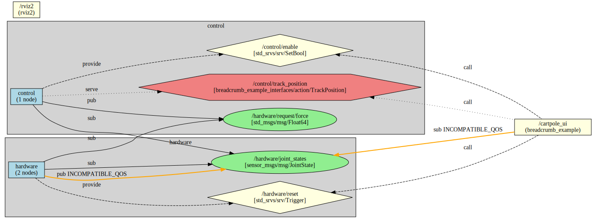

# breadcrumb_example

A complete ROS2 cartpole (inverted pendulum) control system demonstrating the integration of [cake](https://github.com/greenforge-labs/cake), [clingwrap](https://github.com/greenforge-labs/clingwrap), and [breadcrumb](../) for building, launching, and visualizing ROS2 applications.




## Overview

This example implements a simulated cart-pole system with a full state feedback controller and a real-time web dashboard. It demonstrates:

- **cake**: Declarative node interface definitions with automatic code generation (C++ and Python)
- **clingwrap**: Clean, modular launch file architecture with namespace management
- **breadcrumb**: Static graph analysis and visualization of the complete system

The system consists of three nodes working together:
1. **cartpole_simulator** - Physics simulation of an inverted pendulum on a sliding cart
2. **cartpole_controller** - Full state feedback controller for balancing and position tracking
3. **cartpole_ui** - Web-based dashboard for monitoring and control

## Quick Start

### Prerequisites

Currently cake, clingwrap and breadcrumb are not published as apt packages, so you will need to clone all three into a workspace and build them.

### Launch

```bash
ros2 launch breadcrumb_example full_system.launch.py
```

### Access the Web UI

Open your browser to: **http://localhost:3000**

You should see:
- Real-time state display (cart position, velocity, pole angle, angular velocity)
- Controller enable/disable buttons
- Position tracking controls
- Parameter tuning interface for LQR gains

### View in RViz

RViz will launch automatically showing the 3D visualization of the cartpole system. The cart and pole will move in response to the controller commands.

## Visualizing the System with breadcrumb

One of the key features demonstrated here is breadcrumb's ability to analyze and visualize your ROS2 system **without running it**.

### Generate Graph Files

```bash
cd /ws/src/anvil/_src_extras/breadcrumb/breadcrumb_example
breadcrumb launch/full_system.launch.py -o ros_graphs/graph.dot --graph-type grouped_and_full_system
```

Or use the provided script:

```bash
./produce_graphs.sh
```

This generates multiple visualization files in `ros_graphs/`:
- `graph_full_system.dot/.svg` - Complete system showing all nodes and connections
- `graph_toplevel.dot/.svg` - High-level view of namespace groups
- `graph_group_hardware.dot/.svg` - Detailed view of the /hardware namespace
- `graph_group_control.dot/.svg` - Detailed view of the /control namespace

### Render Graphs

To convert DOT files to images:

```bash
cd ros_graphs
dot -Tsvg graph_full_system.dot -o graph_full_system.svg
dot -Tpng graph_full_system.dot -o graph_full_system.png

# Or render all at once
for file in graph_*.dot; do
    dot -Tsvg "$file" -o "${file%.dot}.svg"
done
```

### Understanding the Graphs

The generated graphs show:
- **Nodes** (blue rectangles): All 5 nodes in the system
- **Topics** (green ellipses): Publishers and subscribers with message types
- **Services** (yellow diamonds): Service providers and clients
- **Actions** (red hexagons): Action servers and clients
- **Namespace organization**: How nodes are grouped and communicate across namespaces

## System Architecture

### Nodes

#### 1. cartpole_simulator (C++)
**Location:** `nodes/cartpole_simulator/`

Simulates the physics of a cart-pole system using classical mechanics equations.

#### 2. cartpole_controller (C++)
**Location:** `nodes/cartpole_controller/`

Implements a full state feedback controller to balance the pole upright and track desired cart positions.

Default gains computed from optimal control theory (see `scripts/compute_lqr_gains.py`).

#### 3. cartpole_ui (Python)
**Location:** `nodes/cartpole_ui/`

Provides a real-time web dashboard using Flask with Server-Sent Events (SSE).

### Namespace Organization

- **`/hardware`** - Simulation and state publishing
  - cartpole_simulator
  - robot_state_publisher
- **`/control`** - Controller logic
  - cartpole_controller
- **Root namespace** - UI and visualization
  - cartpole_ui
  - rviz2

## Understanding the Code

### Minimal CMakeLists.txt

The entire package is built with just 5 lines of CMake:

```cmake
cmake_minimum_required(VERSION 3.22)
project(breadcrumb_example)

find_package(cake REQUIRED)
cake_auto_package(INSTALL_TO_SHARE urdf rviz web_templates)
```

The `cake_auto_package()` macro automatically:
- Discovers all nodes in `nodes/`
- Generates C++ and Python interface code from `interface.yaml` files
- Builds libraries and executables
- Registers composable components
- Installs everything to the correct locations
- Exports interface definitions for breadcrumb

### Node Structure with cake

Each node directory contains:
- `interface.yaml` - Declarative interface definition (topics, services, actions, parameters)
- `node_name.cpp` or `node_name.py` - Implementation with `init(context)` function
- Generated code provides `Context` struct with strongly-typed publishers, subscribers, etc.

### Launch Files with clingwrap

The launch files use clingwrap's clean API:

```python
from clingwrap import LaunchBuilder

def generate_launch_description():
    l = LaunchBuilder()

    with l.namespace("hardware"):
        l.node("breadcrumb_example", "cartpole_simulator")

    return l.get()
```

Key features demonstrated:
- Namespace context managers: `with l.namespace("hardware"):`
- Topic remapping: `remap={"force": "/hardware/request/force"}`
- Parameter passing: `parameters={"k1": -3.16, "k2": -5.64, ...}`
- Modular composition: `l.include_launch_py()` to combine subsystems

### breadcrumb Integration

When you build with cake, `interface.yaml` files are automatically installed to:
```
install/breadcrumb_example/share/breadcrumb_example/interfaces/
```

breadcrumb finds these files and uses them to build the complete system graph without running any nodes. This enables documentation, visualization, and architectural analysis of your ROS2 system.

## Key Demonstrations

This example showcases:

### cake Features
- ✓ Automatic code generation from `interface.yaml`
- ✓ Mixed C++ and Python nodes in one package
- ✓ Composable component registration (C++ nodes)
- ✓ Type-safe parameter handling with validation
- ✓ Context-based design pattern (separation of state and ROS communication)
- ✓ Minimal CMake (5 lines for entire package)
- ✓ Interface export for breadcrumb analysis

### clingwrap Features
- ✓ Clean, readable launch file syntax
- ✓ Namespace context managers for organization
- ✓ Modular launch file composition (hardware/control/ui subsystems)
- ✓ Topic and action remapping across namespaces
- ✓ Parameter passing to nodes
- ✓ Static analysis API for breadcrumb

### breadcrumb Features
- ✓ Static graph extraction from launch files
- ✓ Multiple visualization modes (full system, grouped by namespace)
- ✓ Complete interface analysis (topics, services, actions)
- ✓ Remapping resolution
- ✓ Cross-namespace communication visualization

### Integration Benefits
- ✓ Write interface once (YAML), use everywhere (C++, Python, graphs)
- ✓ Launch files that are easy to read and maintain
- ✓ System architecture documentation without running code

## Customization Ideas

Want to experiment? Try:

1. **Modify Physics Parameters**
   - Edit `nodes/cartpole_simulator/init.cpp`
   - Change cart mass, pole mass, pole length, gravity
   - See how it affects control difficulty

2. **Tune Controller Gains**
   - Use the web UI to adjust k1, k2, k3, k4 in real-time
   - Or edit `scripts/compute_lqr_gains.py` and recompute optimal gains
   - Update launch files with new defaults

3. **Add New Sensors**
   - Create a new node in `nodes/` with its own `interface.yaml`
   - Publish additional sensor data
   - Rebuild and watch breadcrumb automatically include it in graphs

4. **Extend the Web UI**
   - Add new controls or visualizations to `web_templates/dashboard.html`
   - Implement new ROS2 service calls in `nodes/cartpole_ui/init.py`
   - Create plots of state history

5. **Implement a Different Controller**
   - Try PID control instead of LQR
   - Add a feedforward term
   - Experiment with model predictive control (MPC)

## Learn More

- [cake README](https://github.com/greenforge-labs/cake/blob/main/README.md) - Declarative code generation
- [clingwrap README](https://github.com/greenforge-labs/clingwrap/blob/main/README.md) - Launch file wrapper
- [breadcrumb README](../README.md) - Static graph analysis

## License

Licensed under the Apache License, Version 2.0. See LICENSE for details.
